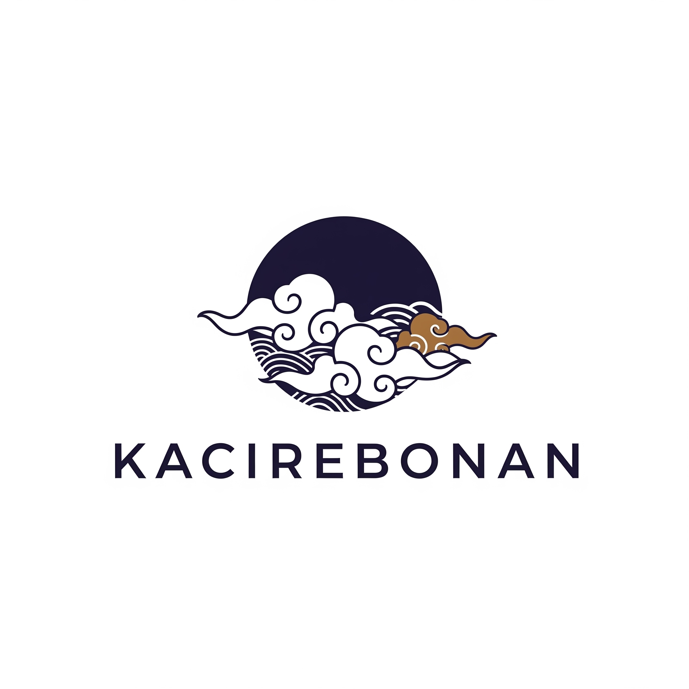

# 🏛️ Kacirebonan

**Jejak Budaya Cirebon: Interaktif & Mendalam**

Platform digital yang didedikasikan untuk mendokumentasikan, melestarikan, dan menyebarluaskan kekayaan budaya Cirebon melalui pengalaman web yang interaktif dan mendalam.


## 📋 Daftar Isi

- [Tentang Proyek](#tentang-proyek)
- [Fitur Utama](#fitur-utama)
- [Teknologi](#teknologi)
- [Struktur Proyek](#struktur-proyek)
- [Instalasi & Penggunaan](#instalasi--penggunaan)
- [Halaman Website](#halaman-website)
- [Kontribusi](#kontribusi)
- [Lisensi](#lisensi)
- [Kontak](#kontak)

## 🎯 Tentang Proyek

Kacirebonan adalah platform digital inovatif yang bertujuan untuk:

- **Melestarikan** warisan budaya Cirebon untuk generasi mendatang
- **Mendokumentasikan** berbagai aspek budaya dengan detail dan akurat
- **Menyebarluaskan** pengetahuan budaya Cirebon kepada masyarakat luas
- **Membangun** komunitas yang peduli terhadap pelestarian budaya

### 🌟 Visi & Misi

**Visi:** Menciptakan generasi yang lebih sadar, bangga, dan terinspirasi untuk melestarikan serta mengembangkan warisan budaya Cirebon.

**Misi:** Menjadi platform digital terdepan yang mendokumentasikan, melestarikan, dan menyebarluaskan kekayaan budaya Cirebon agar dapat diakses oleh semua kalangan.

## ✨ Fitur Utama

### 🎨 User Experience

- **Desain Responsif** - Optimized untuk desktop, tablet, dan mobile
- **Animasi Interaktif** - Smooth scrolling dan hover effects
- **Typography Modern** - Hierarki teks yang jelas dan mudah dibaca
- **Visual Consistency** - Skema warna dan spacing yang konsisten

### 📱 Fungsionalitas

- **Navigation Dinamis** - Menu responsif dengan active states
- **Lightbox Gallery** - Galeri foto dengan navigasi keyboard
- **Contact Form** - Form kontak dengan validasi real-time
- **FAQ Accordion** - Pertanyaan umum dengan expand/collapse
- **Breadcrumbs** - Navigasi lokasi yang jelas

### 🚀 Performance

- **Vanilla JavaScript** - Tanpa dependency framework eksternal
- **Lazy Loading** - Optimisasi loading gambar
- **CSS Grid & Flexbox** - Layout modern dan fleksibel
- **Semantic HTML** - Struktur markup yang accessible

## 🛠️ Teknologi

Proyek ini dibangun dengan teknologi web fundamental untuk memastikan performa optimal dan maintainability:

- **HTML5** - Struktur semantic dan accessible
- **CSS3** - Styling modern dengan Grid, Flexbox, dan Custom Properties
- **Vanilla JavaScript** - Interaktivitas tanpa dependency eksternal
- **SVG** - Icon dan ilustrasi vector yang scalable

### 📦 Tidak Ada Dependencies

Proyek ini sengaja dibuat **tanpa framework atau library eksternal** untuk:

- ⚡ **Performance** yang optimal
- 🔧 **Maintainability** yang mudah
- 📖 **Learning** vanilla web technologies
- 🎯 **Focus** pada konten budaya


## 🚀 Instalasi & Penggunaan

### Persyaratan Sistem

- Web browser modern (Chrome, Firefox, Safari, Edge)
- Web server lokal (opsional untuk development)

### Langkah Instalasi

1. **Clone Repository**

   ```bash
   git clone https://github.com/username/kacirebonan.git
   cd kacirebonan
   ```

2. **Buka di Browser**

   ```bash
   # Opsi 1: Buka langsung file
   open index.html

   # Opsi 2: Gunakan live server (jika tersedia)
   live-server

   # Opsi 3: Python server
   python -m http.server 8000
   ```

3. **Akses Website**
   - File langsung: `file:///path/to/kacirebonan/index.html`
   - Local server: `http://localhost:8000`

### Development

Untuk development, disarankan menggunakan:

- **VS Code** dengan Live Server extension
- **Browser DevTools** untuk debugging
- **Git** untuk version control

## 📖 Halaman Website

### 🏠 Beranda (`index.html`)

- Hero section dengan animasi text hover
- Overview topik budaya
- Timeline sejarah interaktif
- Preview galeri foto

### ℹ️ Tentang Kami (`about.html`)

- Visi dan misi organisasi
- Tim dan nilai-nilai
- Journey dan pencapaian
- Call-to-action untuk bergabung

### 🎭 Budaya (`culture-topics.html`)

- Kategori topik budaya
- Navigation ke halaman spesifik
- Interactive cards dengan hover effects

### 🎨 Batik Cirebon (`batik-cirebon.html`)

- Sejarah dan filosofi batik
- Motif-motif khas Cirebon
- Proses pembuatan batik
- Galeri koleksi batik

### 💃 Seni Pertunjukan (`tari-seni-pertunjukan.html`)

- Tari tradisional Cirebon
- Musik dan alat musik
- Festival dan pertunjukan
- Video dokumenter

### 🍜 Kuliner (`kuliner-cirebon.html`)

- Makanan khas Cirebon
- Resep dan cara pembuatan
- Sejarah kuliner
- Lokasi kuliner recommended

### 🖼️ Galeri (`gallery.html`)

- Koleksi foto budaya Cirebon
- Filter kategori foto
- Lightbox dengan navigation
- Download dan share options

### 📞 Kontak (`contact.html`)

- Form kontak dengan validasi
- Informasi kontak langsung
- Media sosial links
- FAQ dengan accordion
- Peta lokasi

## 🤝 Kontribusi

Kami sangat welcome dengan kontribusi dari komunitas! Berikut cara untuk berkontribusi:

### 💡 Jenis Kontribusi

- **Konten Budaya** - Informasi, foto, atau cerita budaya Cirebon
- **Code Improvement** - Bug fixes, feature enhancements
- **Documentation** - Perbaikan dokumentasi atau tutorial
- **Design** - UI/UX improvements dan asset design
- **Translation** - Terjemahan ke bahasa lain

### 📋 Cara Berkontribusi

1. **Fork** repository ini
2. **Create** branch untuk fitur baru (`git checkout -b feature/nama-fitur`)
3. **Commit** perubahan (`git commit -m 'Menambahkan fitur baru'`)
4. **Push** ke branch (`git push origin feature/nama-fitur`)
5. **Create** Pull Request dengan deskripsi yang jelas

### 🐛 Melaporkan Bug

Jika menemukan bug, silakan:

1. Cek apakah bug sudah dilaporkan di [Issues](https://github.com/username/kacirebonan/issues)
2. Buat issue baru dengan template bug report
3. Sertakan informasi browser, OS, dan langkah reproduce

### 💬 Diskusi

- **GitHub Discussions** - Untuk diskusi umum dan ide
- **Issues** - Untuk bug reports dan feature requests
- **Email** - info@kacirebonan.com untuk komunikasi langsung

## 📄 Lisensi

Proyek ini dilisensikan di bawah [MIT License](LICENSE) - lihat file LICENSE untuk detail lengkap.

### Penggunaan Konten

- **Code** - Bebas digunakan dan dimodifikasi
- **Konten Budaya** - Harap kredit sumber asli
- **Gambar** - Lihat individual image credits
- **Font & Assets** - Lihat respective licenses

## 📞 Kontak

### Tim Kacirebonan

- **Email:** info@kacirebonan.com
- **Telepon:** +62 812-3456-7890
- **Alamat:** Jalan Budaya No. 1, Cirebon, Jawa Barat 45123

### Media Sosial

- **Facebook:** [@Kacirebonan](https://facebook.com/kacirebonan)
- **Instagram:** [@kacirebonan](https://instagram.com/kacirebonan)
- **YouTube:** [Kacirebonan Channel](https://youtube.com/kacirebonan)
- **Twitter:** [@kacirebonan](https://twitter.com/kacirebonan)

### Developer

- **GitHub:** [@username](https://github.com/username)
- **Website:** [kacirebonan.com](https://kacirebonan.com)

---

## 🙏 Acknowledgments

Terima kasih kepada:

- **Pemerintah Kota Cirebon** - Dukungan data dan informasi
- **Seniman & Budayawan Cirebon** - Kontribusi konten budaya
- **Komunitas Open Source** - Inspirasi dan best practices
- **Photographer & Content Contributors** - Visual assets
- **Beta Testers** - Feedback dan testing

---

## 📊 Status Proyek


**Status:** 🚧 Dalam Pengembangan Aktif

**Versi:** 1.0.0

**Last Updated:** Juli 2025

---

<p align="center">
  <strong>Dibuat dengan ❤️ untuk melestarikan Budaya Cirebon</strong>
</p>

<p align="center">
  
</p>
